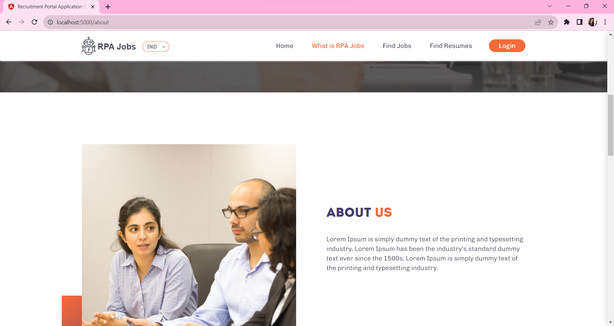
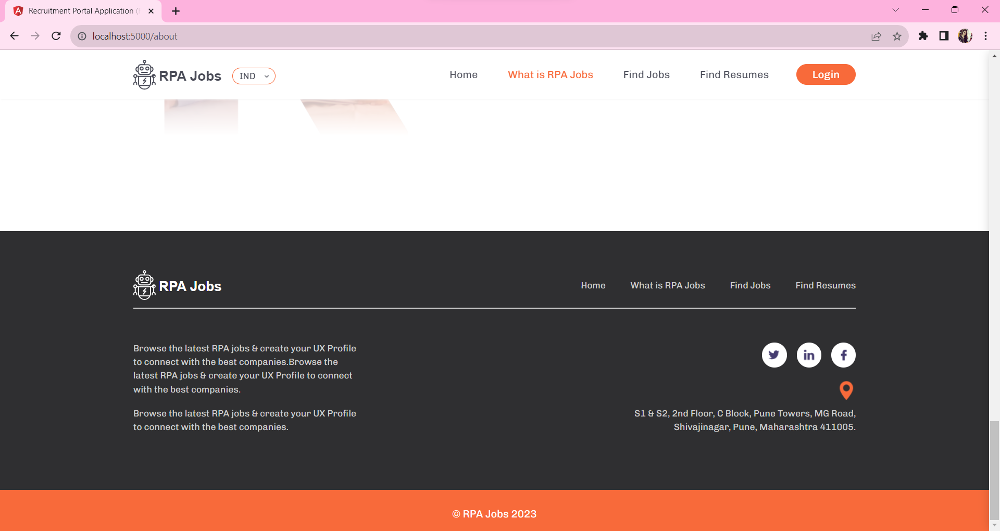

# Recruitment Portal Application

Welcome to the Recruitment Portal Application. This application is designed to streamline the recruitment process with a modern user interface and robust functionality.

## Prerequisites

Before you begin, ensure you have met the following requirements:

- Node.js: Ensure you have Node.js installed. You can download it from [nodejs.org](https://nodejs.org/) version 16.14.2.
- npm: Make sure you have npm installed. This project was built using npm version 8.5.0.
- Angular CLI: This project uses Angular CLI version 14.2.13. If you don't have it installed globally, you can do so by running:

```bash
npm install -g @angular/cli@14.2.13


: The Home Page of the Recruitment Portal, showcasing an inviting and user-friendly design.


: The Login Page for registered users to access their accounts securely.


: The Signup Page for new users to create accounts and join the recruitment platform.


: The About Us Page, providing information about the platform's mission and values.


: The Services Page, detailing the range of services and features offered to users.


: The Features Page, highlighting key functionalities and benefits of the Recruitment Portal.


: The Company Info Page, offering insights into the organization behind the portal and its contact details.